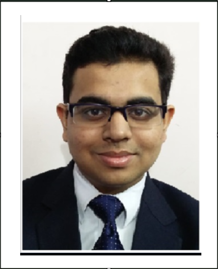

<html lang="en">
<head>
    <meta name="viewport" content="width=device-width, initial-scale=1.0">
    <title> &#x1F3FC; Anmol Sinha | Portfolio &#x1F4C3;</title>
    <link href="https://fonts.googleapis.com/css2?family=Roboto:wght@400;700&display=swap" rel="stylesheet">
    
</head>
<body>
    <header>
        

            
        

         Anmol Sinha 
        
 &emsp;&emsp;&emsp;&emsp;C/C++ | Java | Python | JavaScript | Scala | Groovy | DevOps(CI/CD): Jenkins, Docker, Kubernetes, Ansible | Big Data: Hadoop, Spark, Hive, Kafka | AI (ML/DL): PyTorch, TensorFlow, NLP, LangChain (RAG/LLM) 

    </header>
    <nav>
        <a href="#about">About</a>
        <a href="#skills">Skills</a>
        <a href="#experience">Experience</a>
        <a href="#projects">Projects</a>
        <a href="#contact">Contact</a>
    </nav>
    

        <section id="about" class="section">
            <h2>About Me</h2>
            
I am a Big Data Engineer with expertise in tools like Hadoop, Hive, HUDI, Hadoop, Spark, Iceberg and Kafka. With extensive experience in AWS cloud and DevOps deployments, I specialize in creating scalable data pipelines and optimizing workflows. Additionally, I have worked as a Data Analyst, delivering actionable insights through advanced data processing and visualization techniques. I have extensive experience in designing scalable solutions and highly impactful applications, optimizing and automating workflow and developing data pipelines. I am proficient in the use of modern technologies and passionate about solving complex problems with data-driven approaches.

        </section>
        <section id="skills" class="section">
            <h2>Skills</h2>
            

                <h3>Big Data Engineering</h3>
▪️> [𝗕𝗶𝗴 𝗗𝗮𝘁𝗮]: Extensive experience of data warehousing with Apache Hadoop, Spark, Hive, HUDI, Kafka, IceBerg, Flink etc. for designing efficient ETL Migration Pipelines, and, Real-Time Data Streaming Design to process large-scale datasets.
                

                    
                    
                

                <h3>Deep Learning / Computer Vision / Audio Recognition</h3>
 ▪️> [𝗔𝗿𝘁𝗶𝗳𝗶𝗰𝗶𝗮𝗹 𝗜𝗻𝘁𝗲𝗹𝗹𝗶𝗴𝗲𝗻𝗰𝗲 / 𝗠𝗮𝗰𝗵𝗶𝗻𝗲 𝗟𝗲𝗮𝗿𝗻𝗶𝗻𝗴]: Proficient in implementing AI/ML systems, leveraging NLP, LLMs, RAG, Deep Learning, and Neural Network architectures to deliver impactful insights, including training & testing.
                

                    
                    
                    
                    
                    
                    
                

                <h3>DevOps</h3>
 ▪️> [𝗗𝗲𝘃𝗢𝗽𝘀 𝗗𝗲𝘀𝗶𝗴𝗻]: Skilled in CI/CD pipeline development using Jenkins, Docker, and Kubernetes, Ansible, Apache Airflow for streamlined deployments. With process automation, strong focus on automating assembly pipelines to enhance data processing efficiency and operational performance, used for data modeling with the ability to design conceptual data flows that support business objectives
                

                    
                    
                    
                    
                    
                    
                    
                

                <h3>Cloud Computing</h3>
 ▪️> [𝗖𝗹𝗼𝘂𝗱 𝗖𝗼𝗺𝗽𝘂𝘁𝗶𝗻𝗴]: Skillful in datalakes management using AWS Cloud tools and advanced (PaaS/SaaS) technologies such as CloudFormation, Lambda, StepFunction, Elastic MapReduce (EMR), Simple Queue Service (SQS), Glue, Athena, Database Migration Service (DMS), RDS (Relational Database Service), Kinesis, Firehose etc.
                

                    
                    
                    
                    
                    
                

                <h3>Languages/Libraries/Frameworks</h3>
▪️> [𝗙𝘂𝗹𝗹𝗦𝘁𝗮𝗰𝗸 𝗗𝗲𝘃𝗲𝗹𝗼𝗽𝗺𝗲𝗻𝘁]: Expertise in building robust full-stack applications using the MERN (MogoDB, ExpressJS, NodeJS, ReactJS) stack in Javascript. Furthermore, I have worked with Flask for creating and hosting applications using Python
                

                    
                    
                    
                    
                    
                    
                    
                    
                    
                    
                    
                

            

        </section>
        <section id="experience" class="section">
            <h2>Work Experience</h2>
            <ul>
                <li><strong> Spark Data Engineer</strong> - VHL Technologies (Apr 2024 - Present)  
                    Working for "Citizens Bank (U.S)" on Enterprise Data Frameworks for our Process Metadata Engine - Data Control Centre to unify multiple ETL process requirements like data migration, validation, optimization etc.
                </li>
                <li><strong>Senior Data Engineer</strong> - KFin Technologies (Apr 2024 - Present)  
                    Spearheaded data lake architecture and integrated AWS Cloud with Big Data for optimized ETL pipelines.
                </li>
                <li><strong>Data Engineer</strong> - KFin Technologies (Jun 2022 - Mar 2024)  
                    Developed scalable workflows for stock exchange data processing and reporting systems.
                </li>
                <li><strong>Data Analytics Intern</strong> - HighRadius (Jan 2021 - Aug 2021) 
                    Built ML models and a B2B Invoice Payroll System leveraging Flask and ReactJS.
                </li>
            </ul>
        </section>
        <section id="projects" class="section">
            <h2>Projects</h2>
            <ul>
                <li><strong>Digix:</strong> Automated reporting system using MERN Stack and AWS Glue for Mutual Funds.</li>
                <li><strong>xAlts:</strong> Big Data-powered platform for Alternative Investment Funds (AIFs).</li>
                <li><strong>A.I Emotion Analysis:</strong> Deep Learning-based sentiment recognition tool.</li>
            </ul>
        </section>
        <section id="contact" class="section">
            <h2>Contact</h2>
            
<img src="data:image/png;base64,iVBORw0KGgoAAAANSUhEUgAAAOEAAADhCAMAAAAJbSJIAAABg1BMVEX////qQzVChfQ0qFMAAAD7vAXFIh/Hx8fx9v6Ksvg6gfTt9/ErpU2Bx5LV1dXa7+BmvX14o/Pi6frRRECFyJblTULuaj75tS9ypPf/+uve6f381GrZdnTDFhL67Ovy8vKOjo4mJia5ubkeHh6rq6tYWFhubm4YGBgQEBCCgoKhoaHS0tL+9vX609AwMDA7OztpaWlLS0u/v7/4xMD86ObtX1PqPi95eXnf39/p6elTU1PrSj33urXtW1CKiorjlpX+7Lj80E/23dzJMC3yj4jzlo7uaV/wfnWvUGj0opz//PXtvbzhkI/oqaj/89D+5J/93oz92XzTX17MRUT8xTT80Vj94ZfYcG7948zQPDfpb2fyiF3/9dnznZbadXPVfYC2ocHKuSLB0o1mdsudWYK4uzdqsElbg+CLbKS4OkTnvRieukZWr1SwSViZZpKRt0qSaKF5c73JFQCwujvavSS5R1JlhNqpdZ3bo67itkPddFSStWfXyriwy/pSkPWy3b6h1q9edALNAAALf0lEQVR4nO3d+X/aRhoH4AEUk2tptim7cQ6QhMQNRhgLY4ztEB/BRxzHSbvxtpvNNolbN202bbZ7Js2fviPANiC9oxFIMKPw/TWG6PnMO5cOhAT6pFMJqTinqaXqioiTVeTweCIrWeM/XKmWVG2uKCXSaQdHjaj+StLUZEbMypE4mnziOTkrZpKqJrkkTGhJUV5kgdafeEQWS1pqVKGkinKOPd1pamFlZckGSRRK1TKDjdef+KKcTAwpTCTDrPM6iZdLBCMoTKsyHz4jcVkFh1dIqCn8+IzUFM2RMJGJTPqQHSdStS5VS6GW5asBO6llLZvRQpgqhSd9sMMlHi5ZzBxmYVFcnPShDp3FFfM6xyQscjbE9KeWNREHhQmO5girxJXBQh0QpsqTPsSRU06ThD4AIiSnYaGkTProXEk2AQklLqdBc+J9xB5hSqxN+thcSi2TthQm+Z0HB7NYshKquUkfl4sJa2ZhUZ70UbkaRTIJV/wxypymVh0Uav7phJ3k5vqFaX/MhL3J9gtVf9WokZraK5T8sFobjCz1CKv+a0K8tEmeCxOcbuptEk6cCZN+bELcE5OnwoS/JvvzyKmuUPXbXHiayFJXKPqzSPFYs9IRSn4tUlymibZwib/z27TJaW1hddLH4V2MKREJ6eykj8PDiIbQZxvD/uBtIvLfvqk3eA+FBJXmL/OxWCyf9/p4qLO9PTs7u71t/4e1JSxM2v5Zvrmzuru7u7q304y5cHgjZnv2wdr+w4ODg4f7D2Zt/7qEhSs2fxMrrD46vHdvZube08NHz5abk23J7Qf7t+4+fnzByOO7t9bsjFUB2Q2lzd1DrDvL00erTdcO13G21w7uXujN44OvyZ8QBWRzqWLn0cxgHu1Nqhm/Pnh8YTBPHhA/oqRRgjiU7hzeMQnvzNyeSDNur901+YxmXCN9KJxCEmnZvXNo8nWacWf8Q87sl+YG7BBJrbiYQEXCPzfNJdrN9bH3xge3rH04dwl9MS6hOfhf87sQEA+sX+24r4CzvW9Zod08JMyMRaTB/wjVaCeHe+Or1NmHQIXad8Uigpc0ldskIJ44no2rUgkV2sktuE7nELyk2XtKFhoDjheewWzvExuw3Yj74Kc1BO4OmzZNOGPMG6veV+rsgZ2P2IgqAhdt5F54avyq4I3rLH96QgEk9MQSEoF/ie3eswfizni07OUKJ7/85z/SCC8cQAvUJIKWpfBc2Jfr9Wir4pUPVVrRP9AJn0BlWkXQZTWqIsXCqF5f96pSm+t1nVIIlmkGAecw8qtURYqFgUDgaN6LSs3PH+HvphRe+BKY9UUEbC1iz8xLblCoNzyY/fPLDd2BEOqIIgIuO8VuOxAGdN31Sm2uBwwgtfAWIMy6I8RGdys1X9jSO188uhC4i8apMKAv7Lk3psaWN7vAkYUKAk7pOxYGAo0Ntyq12Vo4+9bRhcAWfwhhoL7lTqUW1nu+lClhILDZcmFMnT+qB5gVBqLro3bGfE+FuiGUEXDH5ZBCPPuP1hkreBnDuDCwMMpSvHA0+HUMCvXoN8NWan5+c/DbWBTibA1XqbFWQ+dEqG8uDwGsdNdpPAgDer3luDMWNi18bgiBU96jCXFjrDs7EdfdSfAjNCrVyQKnslG3BjIsxGMq9ekNvJOAvsVD4V9GFeJ1KuWmEe8k4C/xbqR5RgUkCilPb1SsJgnHQmiPX4aEF/96n+pEDVlIs2ksrNdJX0EpfP63K06Fl759QXO2jSy03zTm57egMcaB8OTlqy8AYRjaW1y8dPn4u+/t+6Kd0GbTSOyC1MKTH15f/d0QwuCHtz/aEm2FxKV45ZuG3acphCevQiFQmIPOYhjCYPD4p+ujC/U6tGnEOwlihdIJX74OEYQRsjD44bsfRxYGgE1jfn7B/pO2QlyhoVGEweC3L+6RSpVOaFWpsVbUtgHthe/ehEIjCoPHf7e448SpMNAY3DQ2BzfzQwmfvwqNLjQGnJ9HFuIxta9SzZv5YYS/vA65IQwGf30BEqmFgUDvpnGZpgvaCt+EQi4J8YADdUYHQr2+0f3yPGWFkoXvXoXcE+JmvD+yEBu32pvGivVe16Hw5euQq0I8NVou4hwJ25tGPEk4AELCkx9CIZeFwNToTBjQGy3iToJW+O5NyH0hnhotthsOhc5jKXz+KuSJMPjrT9+zIDz55fUg0C1h8PjtYKVOQPjujRnomtC8iBu/0Fyh7grxgNO3axy38OSlRQO6K8SLuN4BZ8zCk8Ex1AuhMeAcTkj4zrJC3RcGj8+nxnEKT16CQLeFweDb0wFnjMLuXndMwrNd4/iElpOEh0LcjP/4eZxC60nCUyHeNc7cGZuQVKGeCdtT43iE4CThsRBX6v3DcQhtKtRLYfD4n442e0MJoWXMeISXf/8vZ9s958J/23VBr4WfU53XHT7/+S+Fz1shIlzAHT1H/7t2deJC851abkWvr8c+Y0GI8vSnPx3FOMPKhtC4Y9J9X+csOStC41q1u5WqNzbaJ1eZEaKm/cVOR8DN5c7NuOwIKS5YO/AFzq6NMyTsPuPiCjB6fs8YS0KUL1jeXegc2Oi5m4opIfV1XZv03b3BmNCFmVGPbvTd1ciaEM+Mo63h9MZy/wMN7AmpL9Bb52h+4OsYFI7QGa3uu2VRiBxeAz0HRi0euWFSiCvVyXXsM+DCYIUyLERoy/nMuGX5zBSzQtRyuExtbFh/D7vCfP8jaDapH0FPaLArNG5PpyZG4TvCGRbi8WaD8jzcQgt+OINpIarsURE3lwnPZbItxMtU2z0j3goWSDf0My5EqGBzo7rts3zMC+1u5d60ex6TfSHx7EadXKGcCI1HKoAKbRDGUJ6ExqlGq76oE8dQvoSo0jIvU3W6Z2k5EeJpY2DPqOuUz0PzIhx8CFav0z7Tzo/QeJD5PPS/S8CREOVPz27o0Q36n8/gSXi2hnP0qwtcCbunGresTlb4RYia6wsOH2PnTYgqBYc/msGd0HGmwqnQ/0Kb54CnwmDwxk3vcO1MhVPhVDgV+l94mXlh+BMQAr/QOhVOha5lKrQTlqHfgp4KuRHKn4AQ+NV53wiVT0AIvBuBOyH0i3RZ6P0WFy/RANkRhj46Fr7/wJfwN+DzIvgWlps3eBJevfYZ8PkV8E06n1OVKSvCENQNUQYUIqoyZUV4DSpSVMVGIFRjDStCaJwx3vcEv9GZpk4ZEYI1aryzqwR/OQWRDeFHwuc1wrvzcN7fsOuMDAjhPmhkjvT+Q5yb7y+R8/6iqx5zrnz8gpiPv8EVaqRIeodlJxfJcY0C5Qo5dh+XiO8h9UFqEvldsvwnkkAJ4ISpT1JO2b3Tmfdk07bv5eY8KxTvVuc7VSyEXybrh5SwkLio4T01DQs14svVOU94DguLfh5MlQQWpvw8mIoCFgrgHpj/1Eptoerfjoi7oSH0cUdU0m2h4NuOGM8IHWHJr2Wa07pCya9lahRpWyhk/LlHrKnCqVACLpNynnLqTChU/diI8aRwLpSAq4hcR5Z6hILqv0bs9MIzYRq4jMhxsuk+oaD57YRURBP6hX6bMdrLmX6h5K86VSSTUFgC7nDjMrklwSxMV4FXIXKYxWraQihIWb90xXhWEqyEQtEv875SFKyFfiHKvcB+oT+W4OWEAAuFFP/EclogCYWEzPdwE1dSAlkoFBWeiXFFGgSZhEIxy++8uCgWTR6zUJAyvK7Cc9WEmWMhFNJqmcdKjctq2kJjJcSVKvJ3gjGyYq5QWCiklzgbcGqKZi2BhEapcjRvAAVKFuKpMRnmwxgvlyxGGAohHlWr5UXWkfFF2WoEpRTidlRFJccushZWRJXosxXipLSkKDPYlPGILCa1wTXaMEIjkqYmM2JWjrAAjefkrJhJqpppgTaCsJN0KiEV5zTViAFW5PB4IitZEWelWlK1uaKUSIMDp0X+D8m3Zhla805EAAAAAElFTkSuQmCC" width="20" height="20"><strong>EMail ID: </strong><a href="mailto:anmolsinha.ss5@gmail.com">anmolsinha.ss5@gmail.com</a>

            
<strong>LinkedIn: </strong><a href="https://linkedin.com/in/anmol-sinha-2465852b9">linkedin.com/in/anmol-sinha-2465852b9</a>

            
<img src="data:image/png;base64,iVBORw0KGgoAAAANSUhEUgAAAOEAAADhCAMAAAAJbSJIAAAAhFBMVEX///8AAAD6+vqgoKD8/Pz29vbR0dHY2Njw8PDk5OTn5+cxMTHz8/OCgoLh4eFBQUEqKipjY2MhISHNzc2amprDw8OPj497e3sUFBRXV1cMDAyurq69vb2jo6NHR0dRUVEbGxtwcHCHh4c7Ozu+vr5eXl60tLQmJiZoaGhzc3M9PT1UVFR7uKuzAAAMXElEQVR4nO1d2ZaqOhB1QEAQRAQUEAWn1u7//78jbdsNmpCqkBBc6+yHu+5D48mGDFW7hgwG//EfAGim5Rq6ri9vCMv/3P7fcC1TUz0wAbD04znNAucSz23Pz5NhiST3PXseX5wgS8+hbqkeJC+M8zhyFltv2Axvu3Ci8dlQPVwk3HR145YwyP0hufFcpa7qYQOhnYutl4PJ/SH3tsW570tTm2VzDm5VzLNZb1maxrgtvR+SY8NUTeYVE+N8EkLvjtPGmKimVMN0E9kC+ZU4RMepalq/MIITfNuEY70I+nGGGM5WAr07do56jkYhenrWYRdqORoLqfTuWCjjqLmrDviVWLlKjkh33BG/EuPuLbppKuZ0h2Kednt2jI5dLMA6FsdRdwSnK5ZPJAPeqrPPmH0q4FfiM+uEn7VTxK/ETr4goKUK+ZVIJR8c066OQDqkrkbtGKvmd0N8lPYZZ4Gvmt03/GAmh+C0UE3tF4WUmbr8Us2rgq+leIIbuV4SFvZGML9RoJrSCwKhRpzlqOZDgCPw9LeuqtkQcRVGcXpRzYWCi6AttROpgg9iBA69D3YMDbEugKA8rVAEtq0pGt2KFXjMW05UQ6UzCMOulUjl9nkNPnBqsaOaIsNJ8rDgjsWZ/TzoX7HipKj10VQjY8/HcCwjZCYHCZcId+bJNlCFnMOZWh5UjxqFA9oldt9jG/0D9swYqVcNsVjhPOIuI2eiMMYQNJg/l3S80Sb+mvk3CAtVY/gTeTC9wc06MlrXl407tawp63zewpVi1iLc/hi72mwj3Tv+jFztZ+QhS+5bQQmmrAlRVP9aLxBJiDisD/tqZpTG2t/XKYygwfJ5k6c1bQWxDLnfvqRP2+Oe9cgWtBQnTHPUe/HIzLMjWjDeRuHLsgqZL9KBZMNtmD+zIzylhUIz2+yApE5ozOCzD7DeLLbTGxEf1PRIlCW7jnTytsi2Q2KmhqoB5HuafTQxxFhChU6ba0v2w2PWkeECRtDwfowP0gPrz4WTbcKl4Vqz2cxyjWW4yZzFJ3HP9pcNYwSMjmWfAjyKeeMPRH/DXvvezmHkp7ups/Mq9sqavAQeAGS5NA9vcAa8pKL5J4xFuRzt3SXaQOMK1ia67MqNKj8xtnuIMnZs+oERJBOo+S3flmN2WQUhVjoxw2B1yVibPURYsZucDJBLwd6QecPs7OdAuS4NkoYFErhVFn7okAHO6asjgjw/VJlEPwONkLqOmAbpHR2mCL5gBBoh1TyFfcJcKUOYG0P5iNA4Wv+/IS3mlsGefgeG5O3UhWoSKhlOgGMkhtwg5sw3VFZdWdBBnl+fNcFJXSpLPEDnYYmv1+8AcEx+ICGlDIyQf5QaPNrbTbI1GXClOn72wUzwo0QRoysgEkOepynstL9DCbc7EKN8PvUxcmCohFwJ+DIcDv36o/B9ZoiQloUDpQPV95oC8yhDJ5AIVPpSTYswUVrnh4BkMi7oKGndru41GTt0VUGu6sw3UIJsLYpRYJ4kWUQdAWxZfqMyTXGlTOo2GuRWUymSOhN1XApOSr0nTALFx99kwxz3bbMdWwKVDfp76FuIQC5Pao5QbBC7zeUxTUNERWiguvEIJHT0gP2wvhAlhbH6LjmYnNef82KCWIYqPacHoHrSDdF9V0S8FHb8sQMAYrgPnO5TDm4LPacoKAI8LfTHvjyCX8m2H61/TLgf/L3VIMrS+rAKS8BX4neBGzxd3Vd9UjyggdfVqZx1U/Bp6Khm9gtwBrpXRvUhuQl3qO/38wA7d/KBcjOFCxiqeVUAHnO5mYIlyIVqWhWALenb5qiBy0bUOb6vALvCK20wAh8u/WmfdtseoYPejsDxqr4c93eAD/31BM4wUunbP2ME9hYm8Iicate3jg102Cb8sFAZVHsFeNg6fFdSJQOTAQ6Vngdgu/tNGQZgBdLvj81WwoAa3w7YOjj0jCG0tG4Bjqpu1WtQVbjQce8G0N5rpz5INH+woF7t5wAaVyt6xrAAjtuGZE5/412/oQcO4LdrXSAc4Bw1fwANA8x7xhAaockHUO3R7tlpAd0/EjDDdz3xE7DikfSMIVj3Bn/Dd7VLkwE4C+NNGa7h6V5v6h/64BO/uZyoc4DDSR7YapPe/BUFeCtcG54q9qZK1Byek3qR1BaVCzNwG8DtAJzAbvdKLwUvri94BGDYJ+cCrIHefHx4M6g+GTXw8JqDiBj3I03hDnjOfoZInf5STasCeMJJCI/ivGeEdDiFR2b6ZJnCl+EQEXvqU6YCs8lJleEInsTuqSb2C/iY7dFghGhE3pdpipikXyNUd0RGN4XOgOhY6Wio/PdDP0L5FqIdYJlegfjkSaCa3DfGiOqQ0hBzEYnTiz5c2TdCtBfPS5UXU2zh9SGYz2xqVsF3ycUMcbjwtkIVCkztxP7bqcWU2rRvn90aqPbU9zwuVO2h2DsXOKAhEtkfAqGOKc3zVIuK4OBvCfs+5SzU1QeK5Rq4BPU92B9dAtesFNibUBLg8YoSD6f9jKqvHCr9iKgr39aPhFFk83yV9fgFbqQPaQnbmlzdsQ/O17vD+ZXpkV2Dc1UF+SFuOVW0M4wdVMJWQlHDXjlVGeYMe8nDpwqKG2wP9biyJ6LvCMC3QG+NI7o/alVXYjd3fYbXtQK+RDdH9WsTjeM2mW6LEzhuRZu3/YHhpbNglAbOgKqiLkggGvD8wd50Y96YKVer6acPwNVePdl3kQqm810G82x6wQtJa4gz2VN1GnBeqfWcWTHh7Ku+Po1lqlNmwHtzZvIyLIxaU+e4y2T5/WbEfyXaq6JEjrJ9RLqpWZt9szlhS+E4izANSZ7xKl5PSB/R+x35NGo+Mi/6TCTLySxsd13YnrB2dILh/lHJTrD2zWbTR7Scijk9TDdcIb2IZ+QkTdAk1ZZcq4lQIWvb3u7PodFuc7X0MHXaX1PkEEdB6ovi13K9ZmPm0Ztsr0F61Kf4FLGRu9ykUSHkNkKfnIRnFoS/9WoUtTPo9drb09WJsiX0HJltxpFzjeeILjLNuFImErHjl1+/JmSJeMfgXD9MdxUIcpoeSOmuUK94csGLhLSdUQCuD4HhRP2Xz5Rltq/tN8BtDnXDFKaRExNN13jQ1O+4Oq9hnhayEkzkfadNwXiqolxbuqD3je2DIu6WsKTx3VIFm+oBMwW875cWsCzMhF1T0xzjNGkfMQkqqxfgauHjjKioWQPWDJODmj+dV9Q1dgAoRxMcaIIYsiJH9GYFh4rROWXVxrFu+SCBRyt6Bbv1A71Uo7pFsZrY8Rin8LzfJrCXR0PbqKr+2NxvK+bx+ycirjaDROHpM9Cu7I+ToIkiV+/BUdGeIOyuTnqcpraIm2o6+MIauP6rJABDRlpE+zz1VXymr0U+kRGRf0ZGEgHnDnU/feq5t6T9HWeGn9tGlykBb6FDzbB5ymszU9Jn/MwsvhKpKSpITwAiIEY70f2XcMwzRzvgVzEsXm30B6hDmCZ0rV6PgTC4xtvtLr6souzcKgHVRCX2vCDG/WOUJfYhswqRqIWBge1jpVNced6r6CFoJWYcsLa+lpJjrmuJ4W1EF84X5PgCUJr/cJUXMxy18IJ56j9p615edLsFQ754NC3PUVqmCT9D3vZANOFQFkVuhgfuUDSlh3IiiSIvQ79FavaGbCnaqZSKWU6GH60yCSlnxrA4SqjO52NIlfBh0DKKJ+WtxCdFcTFMspbvmn4Kz4tUsH3DxbB98YBGN6WSjzgzCAaAwWl/8zDkEfVewCyk8reXfRYuz1m0uuwOCfd7xTNcC6ovz7BpgeOOGObCmsQTXXn1DD2BhREbnL7QzSz9FJpRH6KSkzphuBVsWRmYa4i6YMi6hR0PYqaGOoaFDK2hUcevM+RLV4QzlFWQDC7LiCQzlFfvAV2MkhmeJGYmWxHoZJTK0IukpiVPjpCEcJkMv0LZdboWQNSUyDDqoFvViN2yUB5DvZtC6wkrz3TPp6kyGV67a+mwjBs9KikM13Gn1WSTrCkS5khg+JV13ZPDHdPTMMUzPIxVNGpeRjTPmDNARWWYR4r6HEyWDtlUFcswccDp1OIxcYmlNpwMyS0v9q7ipjgTQsImr4RJyHl0+tDzRwsOTwuS1/Rf1s+g/KD8XtcHJum1mlTLbfvXEtrn17QP3+8XRlA83I4Wdd76Qw7yiqBPzUTvMMMg9vzcjpYtppYe2Wvfi4OwTw1v/6C5ur7U202tye0XdLcvy+8/+oF/qjnUVxPdGSkAAAAASUVORK5CYII=" width="20" height="20"><strong>GitHub: </strong><a href="https://github.com/anmol-sinha-coder">github.com/anmol-sinha-coder</a>

        </section>
    

    <footer>
        
&copy; 2024 Anmol Sinha. All rights reserved.

    </footer>
</body>
</html>
